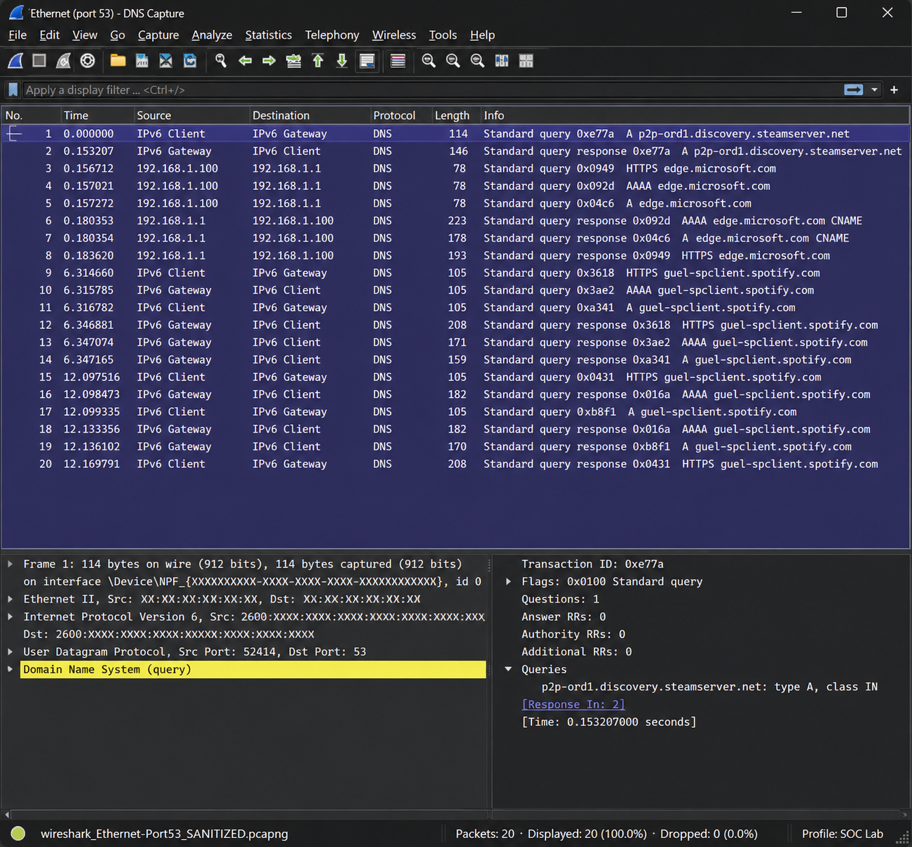

# 🔎 Wireshark Network Traffic Analysis

## Project Overview

This project documents my hands-on experience using Wireshark to capture, filter, inspect, and analyze network traffic in a controlled lab environment.

The labs focus on understanding how network communications appear at the packet level, identifying protocols and endpoints, analyzing DNS and ARP activity, examining TCP/TLS communications, and using capture filters to isolate relevant traffic.

Throughout the project, I also documented troubleshooting steps and connected packet-level observations to their practical use in security monitoring and SOC investigations.

---

## 🎯 Objectives

- Capture and inspect live network traffic using Wireshark.
- Identify common protocols and understand their behavior at the packet level.
- Use capture filters to isolate traffic by protocol, host, network, and port.
- Analyze source and destination IP addresses, ports, and packet headers.
- Examine DNS queries and responses, ARP broadcasts, and TCP/TLS communications.
- Troubleshoot capture and filtering issues using packet-level evidence.
- Relate network traffic analysis to security monitoring and SOC investigations.

## 🧠 Skills Demonstrated

- Network traffic analysis
- Packet inspection
- TCP/IP fundamentals
- DNS and ARP analysis
- TCP/TLS traffic analysis
- Wireshark capture filtering
- Network troubleshooting
- Technical documentation
- Security-focused analytical thinking

---

## 🖥️ Lab Environment

**Operating System:** Windows 11  
**Network Connection:** Ethernet  
**Packet Analyzer:** Wireshark 4.6.8  
**Packet Capture Driver:** Npcap 1.88  
**Lab Type:** Controlled home network environment

## 🛠️ Tools Used

- Wireshark
- Npcap
- Windows Command Prompt
- `nslookup`
- TCP/IP networking utilities

## 🌐 Network Environment

The lab environment used a private IPv4 network for live packet capture and analysis. Traffic was generated intentionally during exercises to observe normal network behavior, protocol communications, DNS resolution, and packet filtering.

Private IP addresses shown in project evidence are from the controlled home lab environment.

---

## 🔬 Hands-On Analysis

### 1. Live Packet Capture

Captured live network traffic from the active Ethernet interface and examined packets using Wireshark's packet list, packet details, and packet bytes panes.

**What I analyzed:**
- Source and destination IP addresses
- Source and destination ports
- Network protocols
- Packet header information
- Communication between local and remote endpoints

**Key takeaway:**  
Packet captures provide visibility into how endpoints communicate and allow an analyst to examine network activity at the packet level.

### 2. ARP Traffic Analysis

Captured and analyzed ARP broadcast traffic on the local network, including ARP requests used to identify the device associated with an IPv4 address.

Example observed behavior:

`Who has 192.168.1.86? Tell 192.168.1.218`

The request was sent to the Ethernet broadcast address:

`ff:ff:ff:ff:ff:ff`

**Key takeaway:**  
ARP allows devices on a local network to associate IPv4 addresses with MAC addresses. Understanding normal ARP behavior provides a baseline for recognizing unusual local network activity.

### 3. DNS Traffic Analysis

Applied a capture filter for DNS traffic:

`port 53`

Generated DNS traffic using:

`nslookup example.com`

Captured and examined DNS queries and responses between the workstation and DNS resolver.

Observed DNS record types included:

- A
- AAAA
- HTTPS

**Key takeaway:**  
DNS analysis can reveal which domains a system is attempting to resolve and can provide useful evidence during network and security investigations.

**Evidence — DNS Capture Using Port 53**

### 4. TCP and TLS Traffic Analysis

Captured TCP traffic and observed encrypted TLS communications between the workstation and remote systems.

Using the capture filter:

`tcp`

isolated TCP-based communications while excluding unrelated protocols such as ARP and UDP.

**What I observed:**
- Source and destination IP addresses
- TCP source and destination ports
- TCP-based application communications
- TLS traffic carried over TCP
- Communication between the local workstation and remote endpoints

**Key takeaway:**  
TCP provides reliable communication for many network applications, while TLS protects application data through encryption. Recognizing TCP and TLS traffic is important when investigating endpoint communications.

### 5. Capture Filter Investigation

Tested multiple Wireshark capture filters to control which packets were recorded.

**Protocol filter:**

`tcp`

The tcp capture filter isolated TCP-based communications while excluding unrelated protocols such as ARP and UDP.

**Host filter:**

`host 192.168.1.226`

Captured traffic where the lab workstation was either the source or destination.

**Network filter:**

`net 192.168.1.0 mask 255.255.255.0`

Captured traffic involving devices within the specified private IPv4 network.

**Port filter:**

`port 53`

Captured traffic where port 53 was either the source or destination port.

During testing, I initially entered the valid but incorrect host address:

`host 192.168.2.226`

Wireshark accepted the filter syntax, but no expected packets appeared. After comparing the filter with the workstation's actual network configuration, I identified and corrected the address.

**Key takeaway:**  
A valid capture filter does not guarantee that the filter contains the intended value. Troubleshooting requires verifying both filter syntax and the network information being investigated.

---

## 🧩 Troubleshooting

Troubleshooting was documented throughout the project rather than removing mistakes from the final results.

Examples included:

- Correcting a valid capture filter that contained the wrong host IP address.
- Clearing display filters that remained active from previous analysis.
- Recognizing that a syntactically valid filter does not guarantee matching traffic.
- Verifying the correct network interface before beginning a capture.
- Comparing observed packet activity with expected network behavior.
- Confirming packet capture statistics to identify whether packets were dropped.

These troubleshooting steps reinforced the importance of validating assumptions and using observable evidence when investigating network activity.

---

## 🛡️ Security Relevance

Packet analysis is valuable to security operations because network traffic can provide evidence about how systems are communicating.

The techniques practiced in this project can support tasks such as:

- Identifying communicating endpoints.
- Determining which protocols and ports are being used.
- Reviewing DNS activity associated with a system.
- Examining local network behavior through ARP.
- Isolating relevant traffic from a larger packet capture.
- Establishing an understanding of normal network behavior.
- Gathering packet-level evidence to support further investigation.

Rather than treating individual packets in isolation, the goal is to use network evidence as part of a broader security investigation.

---

## 💡 What I Learned

This project strengthened my understanding of how TCP/IP communications appear in real network traffic and how Wireshark can be used to move from raw packets to useful investigative information.

One of the most important lessons was that effective packet analysis requires more than knowing which filter to type. An analyst must understand what traffic should be present, verify assumptions, recognize when results do not match expectations, and adjust the investigation based on evidence.

---

## 📸 Evidence

Selected screenshots and supporting evidence will be added to demonstrate packet captures, filtering, protocol analysis, and troubleshooting performed during this project. All evidence will be reviewed and sanitized before publication.

---

## 📋 Project Summary

| Area | Hands-On Practice |
|---|---|
| Live Packet Capture | ✅ Completed |
| Packet Inspection | ✅ Completed |
| ARP Analysis | ✅ Completed |
| DNS Analysis | ✅ Completed |
| TCP/TLS Analysis | ✅ Completed |
| Protocol Capture Filters | ✅ Completed |
| Host Capture Filters | ✅ Completed |
| Network Capture Filters | ✅ Completed |
| Port Capture Filters | ✅ Completed |
| Network Troubleshooting | ✅ Completed |
| Technical Documentation | ✅ Completed |

---

## 🚧 Project Status

**Active — Additional Wireshark analysis and evidence will be added as I continue developing my network security and SOC analysis skills.**

---

> 🦖 **Analyst Note:** Trust the evidence, verify the filter... and never falsely accuse an innocent H.
